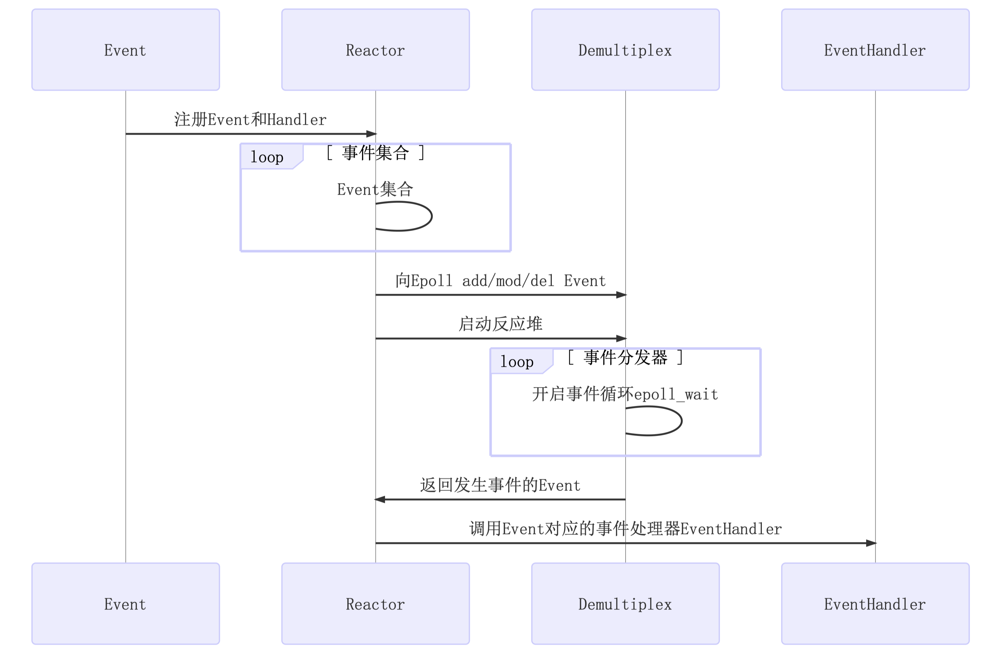

# C++11 Muduo

## 开发环境

* linux kernel version 4.4.0 (ubuntu 16.04 Server)
* gcc version 5.4.0
* cmake version 3.5.1

项目编译执行`./build.sh`即可，测试用例进入`example/`文件夹，`make`即可生成服务器测试用例

## 功能介绍

头文件生成至目录`/usr/include/mymuduo/`，`.so`库文件生成至目录`/usr/lib/`。

1. `EventLoop.*`、`Channel.*`、`Poller.*`、`EPollPoller.*`等主要用于事件轮询检测，并实现了事件分发处理的底层实现方法。`EventLoop`负责轮询执行`Poller`，要进行读、写、错误、关闭等事件时需执行哪些回调函数，均绑定至`Channel`中，只需从中调用即可，事件发生后进行相应的回调处理即可
2. `Thread.*`、`EventLoopThread.*`、`EventLoopThreadPool.*`等将线程和`EventLoop`事件轮询绑定在一起，实现真正意义上的`one loop per thread`
3. `TcpServer.*`、`TcpConnection.*`、`Acceptor.*`、`Socket.*`等是`mainloop`对网络连接的响应并轮询分发至各个`subloop`的实现，其中注册大量回调函数
4. `Buffer.*`为`muduo`网络库自行设计的自动扩容的缓冲区，保证数据有序性到达

## 技术亮点

1. `EventLoop`中使用了`eventfd`来调用`wakeup()`，让`mainloop`唤醒`subloop`的`epoll_wait`阻塞
2. 在`EventLoop`中注册回调`cb`至`pendingFunctors_`，并在`doPendingFunctors`中通过`swap()`的方式，快速换出注册的回调，只在`swap()`时加锁，减少代码临界区长度，提升效率。（若不通过`swap()`的方式去处理，而是加锁执行`pendingFunctors`中的回调，然后解锁，会出现什么问题呢？1. 临界区过大，锁降低了服务器响应效率 2. 若执行的回调中执行`queueInLoop`需要抢占锁时，会发生死锁）
3. `Logger`可以设置日志等级，调试代码时可以开启`DEBUG`打印日志；若启动服务器，由于日志会影响服务器性能，可适当关闭`DEBUG`相关日志输出
4. 在`Thread`中通过`C++lambda`表达式以及信号量机制保证线程创建时的有序性，只有当线程获取到了其自己的`tid`后，才算启动线程完毕
5. `TcpConnection`继承自`enable_shared_from_this`，`TcpConnection`对象可以调用`shared_from_this()`方法给其内部回调函数，相当于创建了一个带引用计数的`shared_ptr`，可参考链接 [link](https://blog.csdn.net/gc348342215/article/details/123215888)，同时`muduo`通过`tie()`方式解决了`TcpConnection`对象生命周期先于`Channel`结束的情况
6. `muduo`采用`Reactor`模型和多线程结合的方式，实现了高并发非阻塞网络库

## 视频介绍

* [muduo源码剖析(1)-简介](https://www.bilibili.com/video/BV1nu411Q7Gq)
* [muduo源码剖析(2)-muduo编写回射服务器实例](https://www.bilibili.com/video/BV1CY411g7AE)
* [muduo源码剖析(3)-Timestamp类日志类](https://www.bilibili.com/video/BV1dF411x7A8)
* [muduo源码剖析(4)-Channel类](https://www.bilibili.com/video/BV14a411h7JW)
* [muduo源码剖析(5)-Poller类、EPollPoller类等相关](https://www.bilibili.com/video/BV1VL4y1u714)
* [muduo源码剖析(6)-EventLoop类介绍1](https://www.bilibili.com/video/BV1aY411g7As)
* [muduo源码剖析(7)-EventLoop类介绍2](https://www.bilibili.com/video/BV1kS4y1S7DC)
* [muduo源码剖析(8)-Thread类、EventLoopThread类](https://www.bilibili.com/video/BV1GL411P73C)
* [muduo源码剖析(9)-EventLoopThreadPool类](https://www.bilibili.com/video/BV1yS4y1S7FY)
* [muduo源码剖析(10)-InetAddress类、Socket类](https://www.bilibili.com/video/BV1UU4y1o7BT)
* [muduo源码剖析(11)-Acceptor类1](https://www.bilibili.com/video/BV1q3411W79d)
* [muduo源码剖析(12)-Acceptor类2](https://www.bilibili.com/video/BV1Ua411b7aV)
* [muduo源码剖析(13)-TcpConnection类、Buffer类](https://www.bilibili.com/video/BV1hS4y137Eg)
* [muduo源码剖析(14)-TcpConnection类、Buffer类2](https://www.bilibili.com/video/BV1PS4y1D74z)
* [muduo源码剖析(15)-TcpConnection类](https://www.bilibili.com/video/BV1L3411p7jy)
* [muduo源码剖析(16)-TcpServer类](https://www.bilibili.com/video/BV13Y411u74h)

持续更新..
